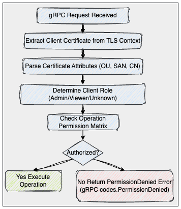

# Job Worker Application Design Document


## Executive Summary

The Job Worker is an enterprise-grade distributed system for executing and managing computational jobs across host machines. It provides a secure gRPC-based service with comprehensive resource management using Linux cgroups, real-time log streaming, and role-based access control. The system features mutual TLS authentication with certificate-based authorization, ensuring secure multi-tenant job execution with proper operational separation.

**Key Capabilities:**
- Secure job execution with resource isolation (CPU, Memory, I/O)
- Role-based access control (Admin/Viewer permissions)
- Real-time log streaming with multi-client support
- Binary-safe output handling
- Enterprise-grade security with mTLS and strong cryptography

## System Architecture

### High-Level Architecture


### Core Components

#### 1. gRPC Service Layer
- **Purpose**: Secure client communications with role-based authorization
- **Key Features**:
  - Mutual TLS authentication with client certificate verification
  - Role-based access control (Admin/Viewer)
  - Message size limits (512KB receive, 4MB send)
  - TLS 1.3 with enterprise-grade cipher suites
  - Operation-level authorization enforcement

#### 2. Job Management Engine
- **Purpose**: Core job execution and lifecycle management
- **Responsibilities**:
  - Process creation with resource limits
  - Child process management and cleanup
  - Status tracking and updates
  - Integration with cgroup resource controls

#### 3. Resource Management System
- **Purpose**: Linux cgroups v2 integration for resource isolation
- **Capabilities**:
  - CPU limits via `cpu.max` (percentage based)
  - Memory limits via `memory.max` and `memory.high`
  - I/O bandwidth limits via `io.max`
  - Automatic cleanup and process termination

#### 4. Data Store & Pub/Sub System
- **Purpose**: Thread-safe job state management with real-time updates
- **Features**:
  - In-memory job storage with concurrent access
  - Publisher/Subscriber pattern for real-time updates
  - Binary-safe log buffering
  - Multi-client streaming support (up to 50 concurrent)

#### 5. Output Management System
- **Purpose**: Captures and streams process output
- **Features**:
  - Real-time stdout/stderr capture
  - Binary-safe data handling
  - Efficient streaming without polling
  - Historical log replay capability

#### 6. Authorization System
- **Purpose**: Certificate-based role extraction and access control
- **Features**:
  - Multi-method role detection (OU, SAN, CN)
  - Operation-level permission enforcement
  - Admin and Viewer role separation
  - Backward compatibility support

#### 7. CLI Client
- **Purpose**: Command-line interface with role-aware operations
- **Features**:
  - Full job lifecycle management
  - Real-time log streaming
  - Flexible parameter handling
  - Role-appropriate error messaging

## API Design

### Protocol Buffer Schema

```protobuf
syntax = "proto3";

service JobService {
  rpc CreateJob(Job) returns (Job) {}                     // Admin only
  rpc GetJob(JobReq) returns (Job) {}                     // Admin + Viewer
  rpc StopJob(JobReq) returns (Job) {}                    // Admin only
  rpc GetJobs(EmptyRequest) returns (Jobs) {}             // Admin + Viewer
  rpc GetJobsStream(JobReq) returns (stream DataChunk) {} // Admin + Viewer
}

message Job {
  string id = 1;                // System-generated unique ID (Unix Nano timestamp)
  string command = 2;           // Executable command
  repeated string args = 3;     // Command arguments
  int32 maxCPU = 4;             // CPU limit in percent (default: 10%)
  int32 maxMemory = 5;          // Memory limit in MB (default: 1MB)
  int32 maxIOBPS = 6;           // IO limit in bytes/second (0 = unlimited)
  string status = 7;            // RUNNING, COMPLETED, STOPPED
  int32 pid = 8;                // Process ID (when running)
  string cgroupPath = 9;        // Cgroup directory path
  string startTime = 10;        // RFC3339 timestamp
  string endTime = 11;          // RFC3339 timestamp
  int32 exitCode = 12;          // Process exit code
}
```

### Authorization Chart

| Operation | Admin Role | Viewer Role | Description |
|-----------|------------|-------------|-------------|
| CreateJob | ALLOW      | DENY        | Start new jobs with resource limits |
| GetJob    | ALLOW      | ALLOW       | Retrieve job details and status |
| StopJob   | ALLOW      | DENY        | Terminate running jobs |
| GetJobs   | ALLOW      | ALLOW       | List all jobs with basic info |
| StreamLogs| ALLOW      | ALLOW       | Real-time log streaming |

## Security Architecture

### Certificate-Based Role Management

#### Role Types and Detection
- **Admin Role**: Full system access with job management capabilities
  - **Detection Methods**:
    - `OU=Admin` in certificate subject
    - `admin.*.local` in Subject Alternative Names
    - "admin" substring in Common Name
  - **Permissions**: All operations (CRUD + streaming)

- **Viewer Role**: Read-only access for monitoring
  - **Detection Methods**:
    - `OU=Viewer` in certificate subject
    - `viewer.*.local` in Subject Alternative Names
    - "viewer" substring in Common Name
  - **Permissions**: Get, List, Stream operations only

#### Certificate Infrastructure

#### TLS Configuration
- **Version**: TLS 1.3 minimum
- **Authentication**: Mutual TLS with mandatory client certificates
- **Cipher Suites**: Modern `ECDHE with AES-GCM` and `ChaCha20-Poly1305`
- **Key Strengths**: `4096-bit` CA, `2048-bit` client keys
- **Certificate Lifetime**: `365` days with renewal processes

### Authorization Flow



## Data Flow Architecture

### Job Lifecycle with Authorization


### Real-Time Log Streaming


## Resource Management

### Linux Cgroups v2 Integration

#### CPU Management
- **Control File**: `cpu.max`
- **Format**: `<microseconds> <period>` (e.g., "50000 100000" = 50%)
- **Fallback**: `cpu.weight` for alternative implementations
- **Default Limit**: 10% of one CPU core

#### Memory Management
- **Hard Limit**: `memory.max` (absolute ceiling)
- **Soft Limit**: `memory.high` (90% of max for early warnings)
- **Units**: Bytes (converted from MB input)
- **Default Limit**: 1MB

#### I/O Management
- **Control File**: `io.max`
- **Multiple Format Support**: Device-specific bandwidth limits
- **Strategies**: Multiple format attempts for device compatibility
- **Default**: Unlimited (0 value)

### Process Isolation
- **Process Groups**: Each job runs in dedicated process group
- **Child Process Handling**: Negative PID kills for complete cleanup
- **Signal escalation**: SIGTERM → SIGKILL for graceful/forced termination
- **Resource Enforcement**: Cgroup limits prevent resource abuse

## Performance and Scalability

### Concurrent Operations
- **Thread Safety**: Mutex-protected data structures throughout
- **Streaming Clients**: Up to 50 concurrent subscribers per job
- **Goroutine Management**: Active monitoring and leak prevention
- **Buffer Management**: Configurable log buffer sizes (1000 lines default)

### Resource Limits and Safeguards
- **gRPC Message Sizes**: 512KB receive, 4MB send limits
- **Header Size Limits**: 1MB maximum header list size
- **Timeout Management**: 5-second subscriber timeout for stalled clients
- **Memory Management**: Bounded log buffers prevent unbounded growth

### Monitoring and Observability
- **Comprehensive Logging**: INFO, WARN, ERROR, DEBUG levels
- **Goroutine Tracking**: Periodic monitoring with automatic dumps
- **Operation Logging**: All authorization decisions logged
- **Performance Metrics**: Job timing, resource usage tracking

## CLI Design and Usage

### Command Structure
TBD

### Role-Based Command Examples

#### Admin Client Operations
TBD

#### Viewer Client Operations
TBD

## Deployment Architecture

### System Requirements
- **Operating System**: Linux with cgroups v2 support
- **Privileges**: Root access required for cgroup management
- **Network**: TCP port `50051` accessible for gRPC communications
- **Storage**: `/opt/job-worker/certs/` directory for certificates
- **Dependencies**: OpenSSL for certificate operations

### Certificate Deployment Strategy
1. **Server Setup**: Generate CA and server certificates on target machine
2. **Client Distribution**: Securely distribute role-specific client certificates
3. **Permission Management**: Proper file permissions (`600` for keys, `644` for certs)
4. **Role Assignment**: Map organizational roles to certificate types

### Configuration Management
- **Cgroup Base Directory**: `/sys/fs/cgroup/job-worker/`
- **Certificate Directory**: `/opt/job-worker/certs/`
- **Log Directory**: `/var/log/job-worker/` (for goroutine monitoring)

## Current Limitations
- **In-Memory Storage**: No persistence across server restarts
- **Single Node Operation**: No distributed execution capabilities
- **Static Role Assignment**: Certificate-based roles cannot be changed at runtime
- **Limited Resource Monitoring**: No real-time resource usage metrics
