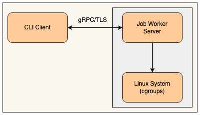
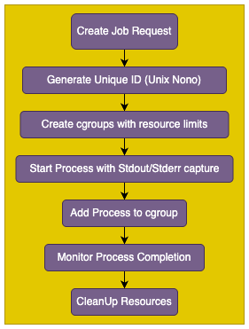
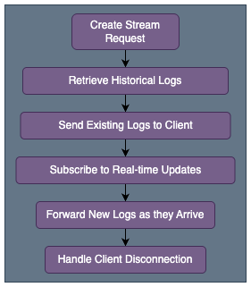

# Job Worker Application Design Document

## Executive Summary

The Job Worker is a distributed system for executing and managing computational jobs across host machines. It provides a gRPC-based service with resource management capabilities using Linux cgroups, real-time log streaming, and a comprehensive CLI client for job management operations.

## System Architecture

### High-Level Architecture



### Core Components

#### 1. gRPC Service Layer
- **Purpose**: Handles client communications with TLS encryption
- **Key Features**:
    - Mutual TLS authentication
    - Message size limits (512KB receive, 4MB send)
    - TLS 1.3 with preferred cipher suites

#### 2. Job Management Engine
- **Purpose**: Core job execution and lifecycle management
- **Responsibilities**:
    - Process creation and monitoring
    - Resource limit enforcement
    - Status tracking and updates

#### 3. Resource Management System
- **Purpose**: Linux cgroups integration for resource isolation
- **Capabilities**:
    - CPU limits (via `cpu.max`)
    - Memory limits (via `memory.max`, `memory.high`)
    - I/O bandwidth limits (via `io.max`)

#### 4. Data Store
- **Purpose**: In-memory job state management with pub/sub pattern
- **Features**:
    - Thread-safe operations
    - Real-time update broadcasting
    - Log buffering

#### 5. CLI Client
- **Purpose**: Command-line interface for job operations

## API Design

### Protocol Buffer Schema

```protobuf
syntax = "proto3";

service JobService {
  rpc CreateJob(Job) returns (Job) {}
  rpc GetJob(JobReq) returns (Job) {}
  rpc StopJob(JobReq) returns (Job) {}
  rpc GetJobs(EmptyRequest) returns (Jobs) {}
  rpc GetJobsStream(JobReq) returns (stream DataChunk) {}
}

message Job {
  string id = 1;
  string command = 2;
  repeated string args = 3;
  int32 maxCPU = 4;
  int32 maxMemory = 5;
  int32 maxIOBPS = 6;
  string status = 7;
  int32 pid = 8;
  string cgroupPath = 9;
  string startTime = 10;
  string endTime = 11;
  int32 exitCode = 12;
  string createdAt = 13;
}
```

### API Operations

#### Job Creation
- **Endpoint**: `CreateJob`
- **Flow**: **Client** → **gRPC** → **Worker** → **Cgroup** → **Process Start**
- **Resource Limits**: CPU, Memory, I/O enforcement using linux cgroups

#### Job Monitoring
- **Endpoint**: `GetJob`
- **Data**: Status, resource usage, timing information
- **Real-time Updates**: Via pub/sub mechanism

#### Log Streaming
- **Endpoint**: `GetJobsStream`
- **Pattern**: Server-side streaming
- **Features**: `Historical logs` + `real-time updates`

## Data Flow Architecture

### Job Lifecycle



### Log Streaming Flow



## Resource Management

### Cgroup Integration

#### CPU Management
- **Primary**: `cpu.max` (cgroup v2)
- **Fallback**: `cpu.weight` (alternative approach)
- **Format**: `<limit> <period>` (e.g., "50000 100000" for 50%)

#### Memory Management
- **Hard Limit**: `memory.max`
- **Soft Limit**: `memory.high` (90% of hard limit)
- **Units**: Bytes (converted from MB input)

#### I/O Management
- **Control File**: `io.max`
- **Multiple Formats**: Device-specific bandwidth limits
- **Fallback Strategy**: Multiple format attempts for compatibility

### Default Resource Limits
- **CPU**: 10% of one core
- **Memory**: 1MB
- **I/O**: No limit (0 = unlimited)

## Security Architecture

### TLS Configuration
- **Version**: TLS 1.3 minimum
- **Authentication**: Mutual TLS (client certificates required)
- **Cipher Suites**: Modern ECDHE suites with AES-GCM and ChaCha20-Poly1305
- **Certificate Management**: CA-based PKI

### Process Isolation
- **Process Groups**: Each job runs in its own process group
- **Resource Isolation**: Linux cgroups enforce limits
- **Signal Handling**: Clean termination with SIGTERM → SIGKILL escalation

## Scalability Considerations

### Concurrent Operations
- **Thread Safety**: Mutex-protected data structures
- **Goroutine Management**: Monitoring for leak prevention
- **Buffer Limits**: 50-client subscription limit per job

### Resource Cleanup
- **Automatic Cleanup**: Goroutine-based cleanup with timeouts
- **Process Management**: Process group termination
- **Cgroup Cleanup**: Systematic directory removal

### Performance Limits
- **Max Receive**: 512KB per message
- **Max Send**: 4MB per message
- **Log Buffer**: 1000 lines in memory
- **Stream Timeout**: 5-second subscriber timeout

## CLI Design

### Command Structure

TODO


### Key Features
- **Parameter Parsing**: Flexible argument handling
- **Real-time Streaming**: Log tailing with Ctrl+C handling
- **Server Configuration**: Configurable server address
- **Error Handling**: Comprehensive error reporting

## Monitoring and Observability

### Logging Strategy
- **Levels**: INFO, WARN, ERROR, DEBUG
- **Components**: All major operations logged

### Job Status Tracking
- **States**: RUNNING, COMPLETED, STOPPED
- **Timestamps**: start, end times
- **Exit Codes**: Process exit status capture
- **Resource Usage**: Cgroup-enforced limits

## Deployment Architecture

### System Requirements
- **OS**: Linux with cgroup v2 support
- **Permissions**: Root access for cgroup management
- **Network**: TCP port 50051 for gRPC
- **Certificates**: TLS certificate infrastructure

## Conclusion

The Job Worker system provides a robust foundation for distributed job execution with strong resource isolation and real-time monitoring capabilities. The architecture supports secure, scalable job management while maintaining simplicity in deployment and operation. The modular design facilitates future enhancements and integration with larger distributed computing platforms.